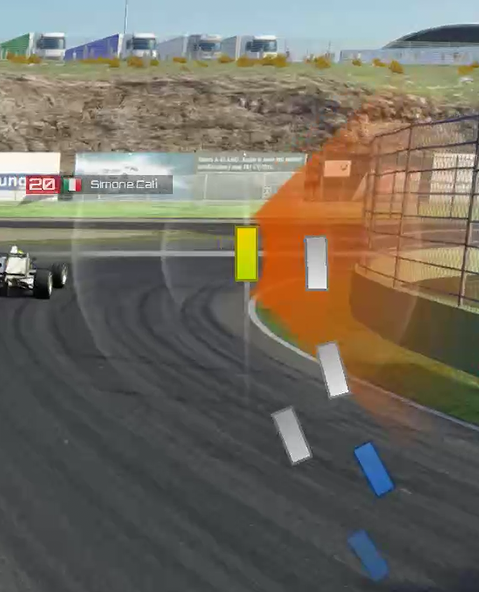

### `helipicapew`插件文档

#### Feature
基于 `helicorsa v7b` 修改，在其基础上：
###### 1. 增加不同车的色彩显示

`黄色`车表示自己
`蓝色`车表示套圈你的车
`绿色`车表示被你套圈的车
`白色`车表示和你同圈的车
###### 2. 车头朝向和实际相同
原版`helicorsa`的车头朝向永远向上，现改为和实际相同
###### 3. 修复`helicorsa v7b`中的BUG
修复了车在右侧很远处经过你，超车指示器也会亮起的BUG。
现在设置为`5`个车身外的车经过你时不会触发超车指示器
###### 4. 去除`helicorsa`中根据minorating决定车辆颜色的功能

#### 性能
经优化，`helipicapew`虽然多做了些计算，但运行性能和`helicorsa`基本相同，未发现明显差距。

#### 使用方法
将`helipicapew`插件压缩包拖到`Content Manager`进行安装，在`Content Manager` -> `SETTINGS` -> `ASSETTO CORSA` -> `APP`中启用Helipicapew


> 注：本APP可和`helicorsa`共存，但为了更好的性能，请只开必要的插件

#### 配置
配置参考目录：`C:\Users\YourUserName\Documents\Assetto Corsa\cfg\apps\helipicapew.ini`

如果想继承`helicorsa`中原有的设置，可将`helicorsa.ini`中的配置内容复杂到`helipicapew.ini`中，但要注意别复制`[helicorsa]`部分。

在`helipicapew.ini`中，可对车的方块颜色进行配置，其对应意义如下：
``` python
# 玩家车辆颜色1（车部部分颜色，默认是黄色）
playerCarFrontColor
# 玩家车辆颜色2（车尾部分颜色，默认是黄色）
playerCarRearColor
# 玩家车辆边框颜色（车尾部分颜色，默认是黄色）
playerCarBorderColor

# 玩家被套圈时车辆颜色1（车部部分颜色，默认是黄色）
playerCarFrontColorBlugFlag
# 玩家被套圈时车辆颜色2（车尾部分颜色，默认是黄色）
playerCarRearColorBlugFlag
# 玩家被套圈时车辆边框颜色（车尾部分颜色，默认是深黄色）
playerCarBorderColorBlugFlag

# 其他车辆颜色1（车部部分颜色，默认是淡灰色）
otherCarFrontColor
# 其他车辆颜色2（车尾部分颜色，默认是白色）
otherCarRearColor
# 其他车辆边框颜色（车尾部分颜色，默认是灰）
otherCarBorderColor

# 套圈玩家的其他车车辆颜色1（车部部分颜色，默认是蓝色）
otherCarFrontColorOverLapping
# 套圈玩家的其他车车辆颜色2（车尾部分颜色，默认是蓝色）
otherCarRearColorOverLapping
# 套圈玩家的其他车车辆边框颜色（车尾部分颜色，默认是深蓝色）
otherCarBorderColorOverLapping

# 其他车被玩家套圈时车辆颜色1（车部部分颜色，默认是绿色）
otherCarFrontColorUnderLapping
# 其他车被玩家套圈时车辆颜色2（车尾部分颜色，默认是绿色）
otherCarRearColorUnderLapping
# 其他车被玩家套圈时车辆边框颜色（车尾部分颜色，默认是深绿色）
```

颜色对应结构是r值, g值, b值，例如：

    playerCarBorderColor=1,0,0
代表把玩家车辆边框颜色设置为红色

> 除上述配置之外，`helipicapew`其他配置和`helicorsa`相同，可参考[Helicorsa Guide](https://steamcommunity.com/sharedfiles/filedetails/?id=605282473)进行配置。

